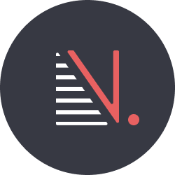

# Simple Notes Falcon

<p align="center">

</p>

Simple notes Falcon is the UI front of the Simply Notes web app. Next.js was used to build this project. Simply-Note is a note-taking app that only does CRUD operations, unlike many other apps. Google Keep was an inspiration for the UI.

This project aimed to understand and use Next.js and Chakra UI together. Hence, it does not feature any advanced note-taking features. Additionally, I tried to implement various techniques that we may use in a production application. This project is not complete (as no web app could ever be sufficiently called complete) as we could always enhance the existing feature, fix bugs and add new features. I plan to revisit this project when I want to try something new.

# Getting Started

-   First, configure and run the [Simple Notes Beaver](https://github.com/Deepak-Kharah/simple-notes-beaver).

    Follow the [getting started](https://github.com/Deepak-Kharah/simple-notes-beaver#readme) section from the README.

-   Install the dependencies

    Install the dependencies by running the following command from your current directory

    ```shell
    npm install
    ```

-   Set up environment variables

    Create a new file at the root of the project, named `.env.local` and copy the content of `.env.example`. Now, replace the URL with the URL at which you are running the [Simple Notes Beaver](https://github.com/Deepak-Kharah/simple-notes-beaver)

-   Run the project
    For developing, run the following command in the terminal from your current directory.
    ```sh
    npm  run dev
    ```

# Tools used in this project

-   **Next.js** is the underlying React framework.
-   UI components and themes are from **Chakra UI**.
-   **Redux** with **Thunk** handles the internal global state management.
-   **React query** manage the external global state management.
-   **Formik** with **Yup** handles the form management.
-   Logo is build using **Figma**.

# The principle

**Simple Notes Falcon** follows the principle of **minimum UI redirects**. When we go to the single notes, it should be inside a modal. Implementing the always-modal mode was a challenge as we could display a modal for the Note when we select it from a list. But, redirecting to an URL of a single note and still providing a modal was new for me.

The project must use types for everything. I tried to develop folder structure and model the components to use typed as much as possible. Thus Axios, stores, dispatch, and everything has the autocomplete feature. Still, module CSS is an exception to this rule.

Finally, the project must contain **easily configurable utilities** to abstract commonly used patterns. One example of this would be the use of the Component.isProtected flag. This flag will protect unauthorized users from accessing the page and redirecting them to the login page. Also, I have implemented the redirect-after-login for the first time.

# The future

In the future, I might try to remove the traction by asking to register only to sync the notes. I could experiment with offline mode as well. Currently, the app uses redux to store the address to redirect after login. But, this should be stored in the query param instead. We could also explore testing and Github CI/CD.

# License

Copyright 2022 Deepak Kharah

Permission is hereby granted, free of charge, to any person obtaining a copy of this software and associated documentation files (the "Software"), to deal in the Software without restriction, including without limitation the rights to use, copy, modify, merge, publish, distribute, sublicense, and/or sell copies of the Software, and to permit persons to whom the Software is furnished to do so, subject to the following conditions:

The above copyright notice and this permission notice shall be included in all copies or substantial portions of the Software.

THE SOFTWARE IS PROVIDED "AS IS", WITHOUT WARRANTY OF ANY KIND, EXPRESS OR IMPLIED, INCLUDING BUT NOT LIMITED TO THE WARRANTIES OF MERCHANTABILITY, FITNESS FOR A PARTICULAR PURPOSE AND NONINFRINGEMENT. IN NO EVENT SHALL THE AUTHORS OR COPYRIGHT HOLDERS BE LIABLE FOR ANY CLAIM, DAMAGES OR OTHER LIABILITY, WHETHER IN AN ACTION OF CONTRACT, TORT OR OTHERWISE, ARISING FROM, OUT OF OR IN CONNECTION WITH THE SOFTWARE OR THE USE OR OTHER DEALINGS IN THE SOFTWARE.
